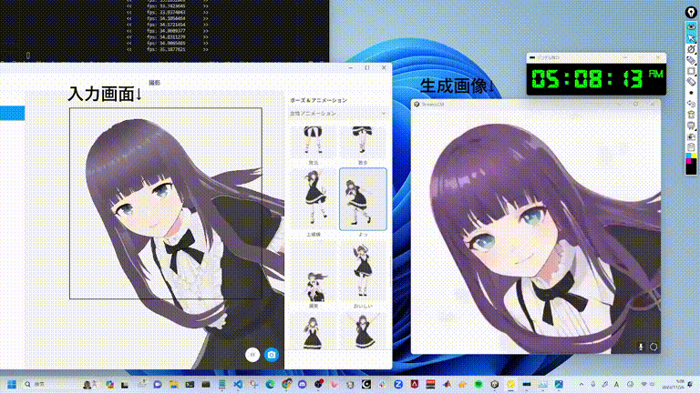
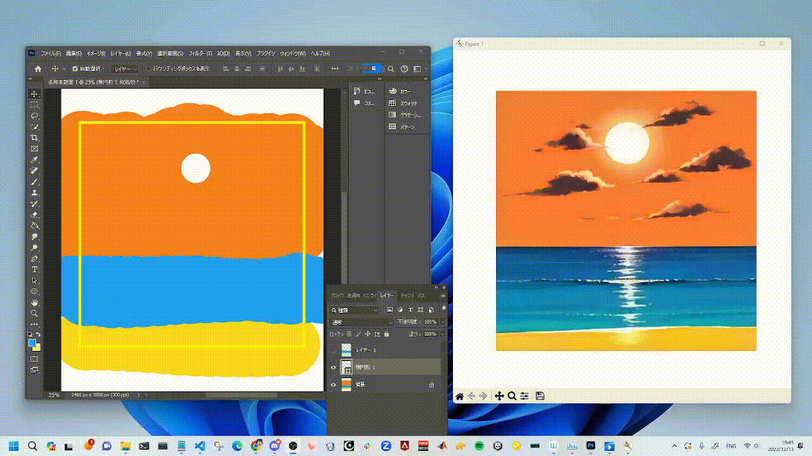
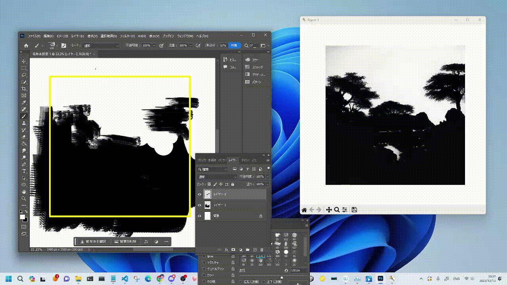
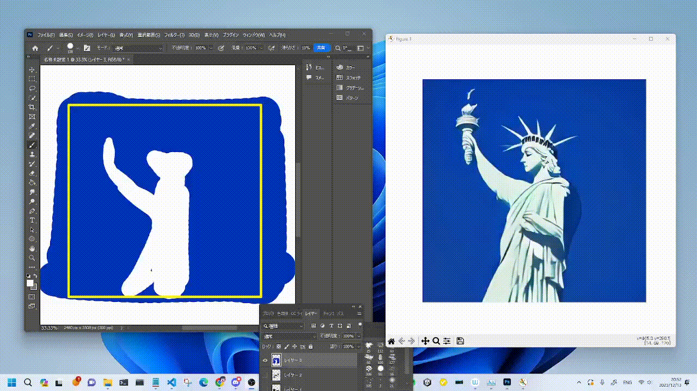
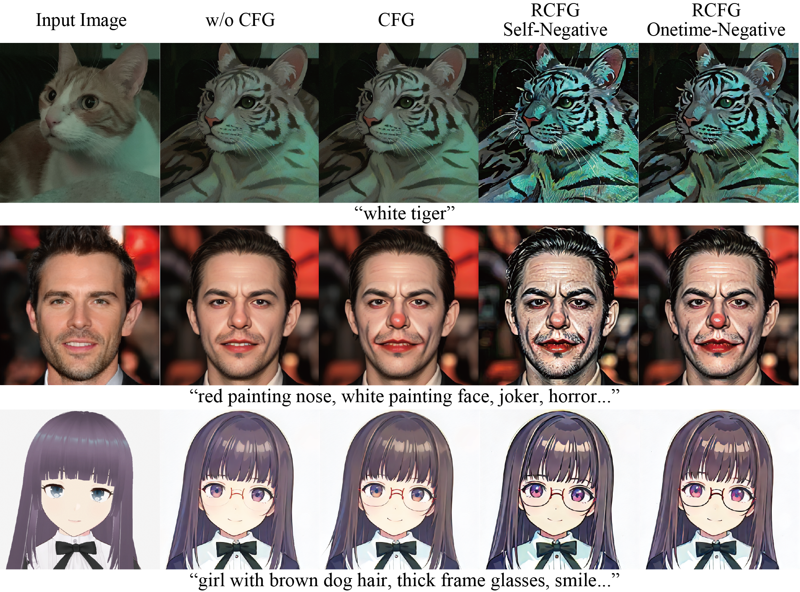

# StreamDiffusion

[English](./README.md) | [日本語](./README-ja.md) | [한국어](./README-ko.md)

<p align="center">
  
  
</p>

# StreamDiffusion: 실시간 이미지 생성을 위한 파이프라인 수준의 솔루션

**Authors:** [Akio Kodaira](https://www.linkedin.com/in/akio-kodaira-1a7b98252/), [Chenfeng Xu](https://www.chenfengx.com/), Toshiki Hazama, [Takanori Yoshimoto](https://twitter.com/__ramu0e__), [Kohei Ohno](https://www.linkedin.com/in/kohei--ohno/), [Shogo Mitsuhori](https://me.ddpn.world/), [Soichi Sugano](https://twitter.com/toni_nimono), [Hanying Cho](https://twitter.com/hanyingcl), [Zhijian Liu](https://zhijianliu.com/), [Kurt Keutzer](https://scholar.google.com/citations?hl=en&user=ID9QePIAAAAJ)

StreamDiffusion은 실시간 이미지 생성을 위해 최적화 된 파이프라인입니다. diffusion을 기반으로 한 기존 이미지 생성 파이프라인과 비교하여, 압도적인 성능 개선을 이뤄냈습니다.

[](https://arxiv.org/abs/2312.12491)
[](https://huggingface.co/papers/2312.12491)

StreamDiffusion을 개발하면서 세심한 지원과 의미 있는 피드백과 토론을 해주신 [Taku Fujimoto](https://twitter.com/AttaQjp), [Radamés Ajna](https://twitter.com/radamar), 그리고 Hugging Face 팀에게 진심으로 감사드립니다.

## 주요 기능

1. **Stream Batch**

   - 디노이징 배치 작업을 통해, 데이터 처리를 효율적으로 진행합니다.

2. **Residual Classifier-Free Guidance** - [자세히](#residual-cfg-rcfg)

   - CFG 메커니즘을 이용하여 중복되는 계산을 최소화합니다.

3. **Stochastic Similarity Filter** - [자세히](#stochastic-similarity-filter)

   - 유사도에 따른 필터링을 진행해 GPU 사용 효율을 극대화합니다.

4. **IO Queues** - [자세히](#IO Queues\*\*)

   - 입출력 연산을 효율적으로 관리하여, 원활한 실행 환경을 제공합니다.

5. **Pre-Computation for KV-Caches**

   - 빠른 처리속도를 위해 캐시 전략을 최적화하였습니다.

6. \*\*Model Acceleration Tools
   - 모델 최적화 및 성능 향상을 위해 다양한 툴들을 활용합니다.

**GPU: RTX 4090**, **CPU: Core i9-13900K**, **OS: Ubuntu 22.04.3 LTS** 환경에서 StreamDiffusion pipeline을 이용하여 이미지를 생성한 결과입니다.

|            model            | Denoising Step | fps on Txt2Img | fps on Img2Img |
| :-------------------------: | :------------: | :------------: | :------------: |
|          SD-turbo           |       1        |     106.16     |     93.897     |
| LCM-LoRA <br>+<br> KohakuV2 |       4        |     38.023     |     37.133     |

제공된 링크를 따라 StreamDiffusion의 기능을 자유롭게 탐색해보시길 바랍니다. 이 프로젝트가 도움이 되셨다면, 저희 작업을 인용해 주시면 감사하겠습니다.

```bash
@article{kodaira2023streamdiffusion,
      title={StreamDiffusion: A Pipeline-level Solution for Real-time Interactive Generation},
      author={Akio Kodaira and Chenfeng Xu and Toshiki Hazama and Takanori Yoshimoto and Kohei Ohno and Shogo Mitsuhori and Soichi Sugano and Hanying Cho and Zhijian Liu and Kurt Keutzer},
      year={2023},
      eprint={2312.12491},
      archivePrefix={arXiv},
      primaryClass={cs.CV}
}
```

## 설치

### Step0: 저장소 clone

```bash
git clone https://github.com/cumulo-autumn/StreamDiffusion.git
```

### 1단계: 환경 설정

StreamDiffusion은 pip, conda 또는 Docker(하단 설명 참조)를 통해 설치할 수 있습니다.

```bash
conda create -n streamdiffusion python=3.10
conda activate streamdiffusion
```

또는

```cmd
python -m venv .venv
# Windows
.\.venv\Scripts\activate
# Linux
source .venv/bin/activate
```

### 2단계: PyTorch 설치

시스템에 알맞는 버전을 설치하시면 됩니다.

CUDA 11.8

```bash
pip3 install torch==2.1.0 torchvision==0.16.0 xformers --index-url https://download.pytorch.org/whl/cu118
```

CUDA 12.1

```bash
pip3 install torch==2.1.0 torchvision==0.16.0 xformers --index-url https://download.pytorch.org/whl/cu121
```

details: https://pytorch.org/

### 3단계: StreamDiffusion 설치

#### 일반 사용자용

StreamDiffusion 설치

```bash
#최신 버전 설치 (추천)
pip install git+https://github.com/cumulo-autumn/StreamDiffusion.git@main#egg=streamdiffusion[tensorrt]


#또는


#안정 버전 설치
pip install streamdiffusion[tensorrt]
```

TensorRT 확장 프로그램 설치

```bash
python -m streamdiffusion.tools.install-tensorrt
```

(윈도우 사용자용) 안정 버젼(`pip install streamdiffusion[tensorrt]`)을 설치한 경우, pywin32를 별도로 설치해야 할 수 있습니다.

```bash
pip install --force-reinstall pywin32
```

#### 개발자용

```bash
python setup.py develop easy_install streamdiffusion[tensorrt]
python -m streamdiffusion.tools.install-tensorrt
```

### Docker 설치 (TensorRT 지원)

```bash
git clone https://github.com/cumulo-autumn/StreamDiffusion.git
cd StreamDiffusion
docker build -t stream-diffusion:latest -f Dockerfile .
docker run --gpus all -it -v $(pwd):/home/ubuntu/streamdiffusion stream-diffusion:latest
```

## Quick Start

[`examples`](./examples) 디렉토리에서 StreamDiffusion을 체험해 보실 수 있습니다.

|  |  |
| :----------------------------: | :----------------------------: |
|  |  |

## 실시간 Txt2Img 데모

[`demo/realtime-txt2img`](./demo/realtime-txt2img) 디렉토리에서 실시간 txt2img 데모를 사용해 보실 수 있습니다!

<p align="center">
  
</p>

## 실시간 Img2Img 데모

실시간 웹 카메라 및 스크린 캡쳐에 대한 Web img2img 데모는 [`demo/realtime-img2img`](./demo/realtime-img2img)에서 보실 수 있습니다.

<p align="center">
  
</p>

## 사용 예제

StreamDiffusion 사용법 간단한 예시들을 제공합니다. 더 자세한 예제를 확인하고자 한다면 [`examples`](./examples)를 참고해주시길 바랍니다.

### Image-to-Image

```python
import torch
from diffusers import AutoencoderTiny, StableDiffusionPipeline
from diffusers.utils import load_image

from streamdiffusion import StreamDiffusion
from streamdiffusion.image_utils import postprocess_image

# diffusers의 StableDiffusionPipeline을 사용하여 모든 모델을 로드할 수 있습니다
pipe = StableDiffusionPipeline.from_pretrained("KBlueLeaf/kohaku-v2.1").to(
    device=torch.device("cuda"),
    dtype=torch.float16,
)

# StreamDiffusion에 파이프라인을 래핑합니다
stream = StreamDiffusion(
    pipe,
    t_index_list=[32, 45],
    torch_dtype=torch.float16,
)

# 로드된 모델이 LCM이 아닌 경우, LCM을 병합합니다
stream.load_lcm_lora()
stream.fuse_lora()
# 더 빠른 가속을 위해 Tiny VAE 사용합니다
stream.vae = AutoencoderTiny.from_pretrained("madebyollin/taesd").to(device=pipe.device, dtype=pipe.dtype)
# 가속화 활성화
pipe.enable_xformers_memory_efficient_attention()


prompt = "1girl with dog hair, thick frame glasses"
# 스트림을 준비합니다
stream.prepare(prompt)

# 이미지를 준비합니다
init_image = load_image("assets/img2img_example.png").resize((512, 512))

# 웜업 >= len(t_index_list) x frame_buffer_size
for _ in range(2):
    stream(init_image)

# 스트림 루프를 실행합니다
while True:
    x_output = stream(init_image)
    postprocess_image(x_output, output_type="pil")[0].show()
    input_response = input("계속하려면 Enter를 누르거나, 종료하려면 'stop'을 입력하세요: ")
    if input_response == "stop":
        break
```

### Text-to-Image

```python
import torch
from diffusers import AutoencoderTiny, StableDiffusionPipeline

from streamdiffusion import StreamDiffusion
from streamdiffusion.image_utils import postprocess_image

# diffusers의 StableDiffusionPipeline을 사용하여 모든 모델을 로드할 수 있습니다
pipe = StableDiffusionPipeline.from_pretrained("KBlueLeaf/kohaku-v2.1").to(
    device=torch.device("cuda"),
    dtype=torch.float16,
)

# StreamDiffusion에 파이프라인을 래핑합니다
# 텍스트-이미지 변환에서는 더 많은 긴 단계(len(t_index_list))가 필요합니다
# 텍스트-이미지 변환 시 cfg_type="none"을 사용하는 것을 권장합니다
stream = StreamDiffusion(
    pipe,
    t_index_list=[0, 16, 32, 45],
    torch_dtype=torch.float16,
    cfg_type="none",
)

# 로드된 모델이 LCM이 아닌 경우, LCM을 병합합니다
stream.load_lcm_lora()
stream.fuse_lora()
# 더 빠른 가속을 위해 Tiny VAE 사용합니다
stream.vae = AutoencoderTiny.from_pretrained("madebyollin/taesd").to(device=pipe.device, dtype=pipe.dtype)
# 가속화 활성화
pipe.enable_xformers_memory_efficient_attention()


prompt = "1girl with dog hair, thick frame glasses"
# 스트림을 준비합니다
stream.prepare(prompt)

# 웜업 >= len(t_index_list) x frame_buffer_size
for _ in range(4):
    stream()

# 스트림 루프를 실행합니다
while True:
    x_output = stream.txt2img()
    postprocess_image(x_output, output_type="pil")[0].show()
    input_response = input("계속하려면 Enter를 누르거나, 종료하려면 'stop'을 입력하세요: ")
    if input_response == "stop":
        break
```

SD-Turbo를 사용하면 속도를 더 개선할 수 있습니다.

### 속도 개선하기

위 예제에서 다음의 코드들을 교체하세요.

```python
pipe.enable_xformers_memory_efficient_attention()
```

해당 부분을

```python
from streamdiffusion.acceleration.tensorrt import accelerate_with_tensorrt

stream = accelerate_with_tensorrt(
    stream, "engines", max_batch_size=2,
)
```

TensorRT 확장과 엔진 빌드 시간이 필요하지만, 위 예제보다 속도를 개선할 수 있습니다.

## 선택 사항

### Stochastic Similarity Filter


Stochastic Similarity Filter 기법을 사용하여, 이전 프레임과의 변화가 적은 경우, 변환 작업을 통합하여 비디오 입력 처리 시간을 개선합니다. 이를 통해, GPU 처리 부하를 줄입니다. 위 GIF의 빨간 프레임에서 볼 수 있듯이 사용 방법은 다음과 같습니다:

```python
stream = StreamDiffusion(
    pipe,
    [32, 45],
    torch_dtype=torch.float16,
)
stream.enable_similar_image_filter(
    similar_image_filter_threshold,
    similar_image_filter_max_skip_frame,
)
```

다음과 같은 매개변수를 함수의 인수로 설정할 수 있습니다:

#### `similar_image_filter_threshold`

- 이전 프레임과 현재 프레임 사이의 유사성 임계값으로, 이 값 이하일 때 처리가 일시 중단됩니다.

#### `similar_image_filter_max_skip_frame`

- 일시 중단 기간 동안 최대 스킵할 수 있는 프레임 간격입니다.

### Residual CFG (RCFG)



RCFG는 CFG를 사용하지 않는 경우와 비교하여 경쟁적인 계산 복잡성을 가진 CFG를 대략적으로 구현하는 방법입니다. StreamDiffusion의 cfg_type 인수를 통해 지정할 수 있습니다. RCFG에는 두 가지 유형이 있습니다: 부정적 프롬프트를 지정하지 않은 RCFG Self-Negative와 부정적 프롬프트를 지정할 수 있는 RCFG Onetime-Negative. 계산 복잡성 측면에서, CFG 없이 N으로 표시되는 복잡성과 일반적인 CFG로 2N으로 표시되는 복잡성을 비교할 때, RCFG Self-Negative는 N단계로 계산할 수 있으며, RCFG Onetime-Negative는 N+1단계로 계산할 수 있습니다.

사용 방법은 다음과 같습니다:

```python
# CFG 없음
cfg_type = "none"
# CFG
cfg_type = "full"
# RCFG Self-Negative
cfg_type = "self"
# RCFG Onetime-Negative
cfg_type = "initialize"
stream = StreamDiffusion(
    pipe,
    [32, 45],
    torch_dtype=torch.float16,
    cfg_type=cfg_type,
)
stream.prepare(
    prompt="1girl, purple hair",
    guidance_scale=guidance_scale,
    delta=delta,
)
```

delta는 RCFG의 효과를 완화하는 역할을 합니다.

## 개발팀

[Aki](https://twitter.com/cumulo_autumn),
[Ararat](https://twitter.com/AttaQjp),
[Chenfeng Xu](https://twitter.com/Chenfeng_X),
[ddPn08](https://twitter.com/ddPn08),
[kizamimi](https://twitter.com/ArtengMimi),
[ramune](https://twitter.com/__ramu0e__),
[teftef](https://twitter.com/hanyingcl),
[Tonimono](https://twitter.com/toni_nimono),
[Verb](https://twitter.com/IMG_5955),

(\*alphabetical order)
</br>

## 감사의 말

이 GitHub 저장소의 비디오 및 이미지 데모는 [LCM-LoRA](https://huggingface.co/latent-consistency/lcm-lora-sdv1-5) + [KohakuV2](https://civitai.com/models/136268/kohaku-v2) 및 [SD-Turbo](https://arxiv.org/abs/2311.17042)를 사용하여 생성되었습니다.

LCM-LoRA를 제공해 주신 [LCM-LoRA authors](https://latent-consistency-models.github.io/)과 KohakuV2 모델을 제공해 주신 Kohaku BlueLeaf ([@KBlueleaf](https://twitter.com/KBlueleaf)), 그리고 [SD-Turbo](https://arxiv.org/abs/2311.17042)를 제공해 주신 [Stability AI](https://ja.stability.ai/)에 특별한 감사를 드립니다.

KohakuV2 모델은 [Civitai](https://civitai.com/models/136268/kohaku-v2) 및 [Hugging Face](https://huggingface.co/KBlueLeaf/kohaku-v2.1)에서 다운로드할 수 있습니다.

SD-Turbo는 [Hugging Face Space](https://huggingface.co/stabilityai/sd-turbo)에서도 이용할 수 있습니다.

## Contributors

<a href="https://github.com/cumulo-autumn/StreamDiffusion/graphs/contributors">
  
</a>
